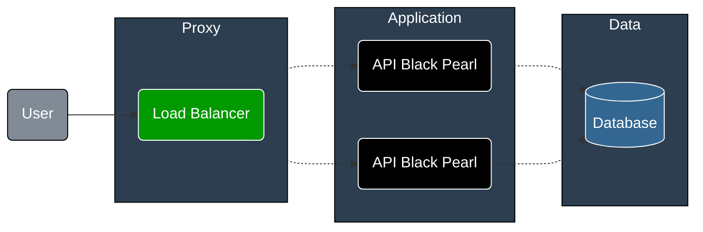

# Black Pearl

## Project to Study Software Development

This project is a simple application to study software development using Ruby on Rails. The main goal is to learn how to build a web api application using the Ruby on Rails framework.

This project are inspired by the [Rinha de Backend](https://github.com/zanfranceschi/rinha-de-backend-2024-q1) project. The project is a api application to manage a customers credit and debit transactions.

## Architecture

