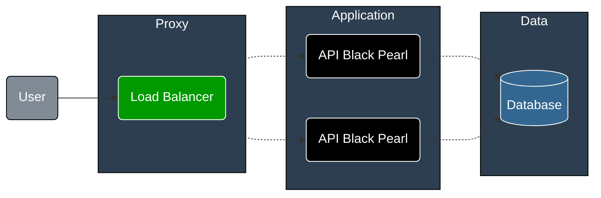
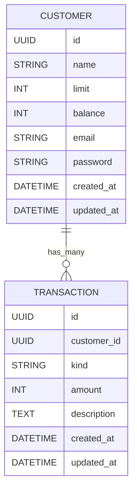

# Black Pearl

[](https://github.com/fabianoflorentino/blackpearl/actions/workflows/brakeman.yml)
[](https://github.com/fabianoflorentino/blackpearl/actions/workflows/rspec.yml)
[](https://github.com/fabianoflorentino/blackpearl/actions/workflows/rubocop.yml)

## Project to Study Software Development

This project is a simple application to study software development using Ruby on Rails. The main goal is to learn how to build a web api application using the Ruby on Rails framework.

This project are inspired by the [Rinha de Backend](https://github.com/zanfranceschi/rinha-de-backend-2024-q1) project. The project is a api application to manage a customers credit and debit transactions.

## Architecture



### Database



## Endpoints

### CUSTOMER

- `GET /customers`: List all customers
- `GET /customers/:id`: Show a customer
- `POST /customers`: Create a customer
- `PATCH /customers/:id`: Update a customer
- `DELETE /customers/:id`: Delete a customer

### Customer Parameters

| Parameter | Type | Description | Required | Observations |
| :--- | :---: | :--- | :---: | :--- |
| name | string | Customer name | true | Customer name must have maximum 100 characters |
| limit | integer | Customer limit | true | Customer limit must be greater than 0 |
| email | string | Customer email | true | Customer email must be a valid email |
| password | string | Customer password | true | Customer password must have minimum 8 characters |

#### Customer Request Example

`cURL`

```shell
curl --location --request POST 'http://localhost:9999/customers' \
--header 'Content-Type: application/json' \
--data '{
  "customer": {
    "name": "John Doe",
    "limit": 1000,
    "email": "customer@example.com",
    "password": "12345678"
  }
}'
```

### EXTRACT

- `GET /customers/:customer_id/extract`: List all transactions of a customer

### TRANSACTION

- `POST /customers/:customer_id/transactions`: Create a transaction for a customer

### Transaction Parameters

| Parameter | Type | Description | Required | Observations |
| :--- | :---: | :--- | :---: | :--- |
| kind | string | Transaction kind (c for credit, d for debit) | true | Transaction kind must be c or d |
| amount | integer | Transaction amount | true | Transaction amount must be greater than 0 |
| description | text | Transaction description | true | Transaction must have maximum 10 characters |

#### Transaction Request Example

`cURL`

```shell
curl --location 'http://localhost:9999/customers/5c515ff2-7236-4543-8cf4-92c02acc86bc/transactions' \
--header 'Content-Type: application/json' \
--data '{
  "transaction": {
    "amount": 2,
    "kind": "d",
    "description": "debt"
  }
}'
```
